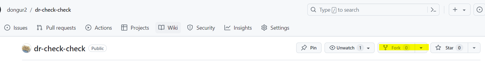

# 📚 책책박사
**목표: 1달에 책 1권씩 읽고 책책박사가 되기 & 눈과 머리에 용어와 지식을 바르기**

처음부터 완벽한 학습을 목표로 하지 않고, <u>용어와 흐름에 익숙해지기 위한 독서</u>를 해봅시다.. (배경지식을 쌓자 😵)

## 📚 참여
1. **<u>1챕터 당 1파일씩</u> 요약정리본을 작성**
   - 형식과 분량 자유: 본인이 이해하고 요약 가능한 형식으로 작성 (이미지 포함 가능)
   - 마크다운 문서로 작성: https://www.easy-me.com/d 링크의 마크다운 에디터 사용 추천
2. **작성한 정리본은 <u>매주 화요일 7시 전에</u> 원본 레포로 `PR` 생성**
   - `PR`은 화요일 7시나 스터디 후에 한꺼번에 받겠습니다.

## 📚 책 목록
01. 쉽게 배우는 운영체제(조성호) 24.06.22 ~ 08.07
02. 객체지향의 사실과 오해(조영호) 24.08.21 ~

<br>

## 🔖 패키지/파일 규칙
**패키지 경로**: `{본인 이니셜}._{책 번호}.week{주차}`
```
ex.
dy._01.week01
```

**파일 이름**: `ch{챕터번호}_{본인 이니셜}.md` (마크업 문서)
```
ch01_dy.md
```


## 🔖 깃 가이드라인
#### <u>본인 파일 외 다른 사람 파일 수정/삭제 금지</u>
1. 원본 레포지토리 `fork`
    

2. 포크해 간 <u>본인 레포지토리로 이동 후</u> `clone`
    ```
    git clone { 본인 repo 주소 }
    ```
3. 로컬 환경에서 <u>본인 이름 이니셜</u>로 브랜치 생성 후 문서 작성
    ```
    git checkout -b { 본인 이름 이니셜 } // 로컬 브랜치 생성 후 생성한 브랜치로 이동
   
   ex. git checkout -b dy
   ```
4. 문서 작성 후 `push`
    - **커밋 메세지 형식**: `Add: {책번호}/{주차}/{챕터}/{이니셜}`
    - 문서를 수정할 경우 커밋 메시지 형식: `Edit: {책번호}/{주차}/{챕터}/{이니셜}`
    - <u>커밋은 한 챕터 문서 작성 완료마다 할 수 있도록 함: 1챕터당 1커밋</u> 
    ```
   git add . // 작업한 모든 내용(.) 스테이징
    git commit -m '{ commit_message }' // 커밋 메세지 작성 & 커밋
    git push origin { 지금까지 작업한 브랜치 이름 } // 원격 저장소의 브랜치에 push
   
   ex.
    git add .
    git commit -m 'Add: 01/week01/ch01/dy' 
    git push origin dy
    ```

5. 웹 페이지에서 `PR(Pull Request)` 작성
    - 원본 레포지토리의 `main` 브랜치로 `PR`
    - `PR` 제목 형식: `{책번호}/{주차}/{챕터}/{이니셜}`
      - `ex. 01/week01/ch01-02/dy` : 커밋 메세지와 챕터 부분만 다르게 작성


6. `PR Merge` 이후 본인 레포지토리로 `pull`
```
git pull upstream main // 원본 레포지토리 main 브랜치를 본인 로컬로 pull
git push origin { 본인 브랜치 이름 } // 본인의 원격 레포 브랜치로 새로 받아온 내용 push
```
